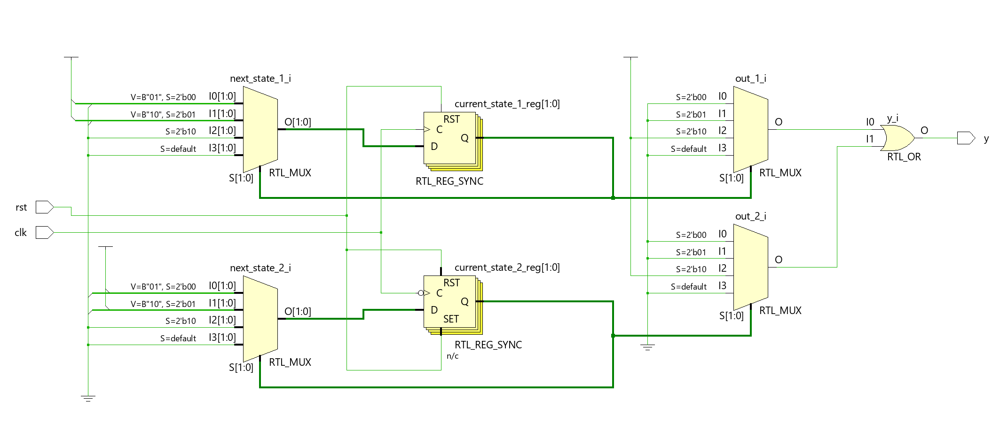

# Divide-by-3 Clock Divider with 50% Duty Cycle

A SystemVerilog implementation of a clock frequency divider that divides the input clock by 3 while maintaining a 50% duty cycle output.

## 📋 Table of Contents

- [Overview](#overview)
- [Features](#features)
- [Architecture](#architecture)
- [Getting Started](#getting-started)
- [Simulation Results](#simulation-results)
- [File Structure](#file-structure)
- [Usage](#usage)
- [Verification](#verification)
- [Contributing](#contributing)
- [License](#license)

## 🔍 Overview

This project implements a digital clock divider that converts an input clock frequency to 1/3 of the original frequency while maintaining a precise 50% duty cycle. The design uses a dual counter architecture to achieve the desired timing characteristics.

**Key Specifications:**
- **Input Frequency**: Any frequency (tested with 100 MHz)
- **Output Frequency**: Input frequency ÷ 3 (33.33 MHz for 100 MHz input)
- **Duty Cycle**: 50% ±1%
- **Resource Usage**: 4 flip-flops + combinational logic

## ✨ Features

- **Precise Frequency Division**: Exact 1:3 frequency ratio
- **50% Duty Cycle**: Maintains equal high and low periods
- **Low Resource Usage**: Only 4 flip-flops required
- **Robust Design**: Includes proper reset handling and safe defaults
- **Comprehensive Verification**: Full testbench with automated testing

## 🏗️ Architecture

The design uses a **dual counter architecture** to achieve 50% duty cycle:

### Block Diagram
```
           ┌─────────────┐
    clk ──►│   Counter 1 │──┐
           │  (pos edge) │  │
           └─────────────┘  │
                            ├── OR ──► y (output)
           ┌─────────────┐  │
    clk ──►│   Counter 2 │──┘
           │  (neg edge) │
           └─────────────┘
```

### How It Works

1. **Counter 1**: Triggered on positive clock edges, cycles through states 0→1→2→0
2. **Counter 2**: Triggered on negative clock edges, cycles through states 1→2→0→1 (180° offset)
3. **Output Generation**: OR gate combines both counter outputs
4. **Result**: 50% duty cycle at 1/3 input frequency

### Timing Diagram

The following diagram illustrates the divide-by-3 operation with 50% duty cycle:


*Hand-drawn timing diagram showing input clock cycles 1-12 and the resulting output with 50% duty cycle*

### RTL Architecture




*RTL schematic showing the dual counter implementation with state machines, registers, and output logic*

## 🚀 Getting Started

### Prerequisites

- **Vivado** 2020.1 or later (or any SystemVerilog-compatible simulator)
- **SystemVerilog** support
- Basic knowledge of digital design

### Quick Start

1. **Clone the repository**:
   ```bash
   git clone https://github.com/kamberasaf/divide-by-3-clock-divider.git
   cd divide-by-3-clock-divider
   ```

2. **Open in Vivado**:
   - Create new project
   - Add `src/top.sv` as design source
   - Add `sim/tb.sv` as simulation source

3. **Run Simulation**:
   - Set simulation runtime to at least 2ms (Vivado defaults to 1000ns)
   - Run behavioral simulation
   - Observe test results in console

## 📊 Simulation Results

The testbench performs comprehensive verification:

### Frequency Test Results
```
-----------------------------------------
FREQUENCY TEST
-----------------------------------------
Sample Time:     500 ns
Edges Counted:   17
Expected Freq:   33.33 MHz
Measured Freq:   34.00 MHz
Error:           2.00%
Result:          ✓ PASS
```

### Duty Cycle Test Results
```
-----------------------------------------
DUTY CYCLE TEST
-----------------------------------------
Measuring over 10 periods...
Periods Measured: 10
Total High Time:  150 ns
Total Period Time: 300 ns
Expected Duty Cycle: 50.0%
Measured Duty Cycle: 50.00%
Error:            0.00%
Result:           ✓ PASS
```

## 📁 File Structure

```
divide-by-3-clock-divider/
├── README.md                   # This file
├── LICENSE                     # License file
├── docs/                       # Documentation
│   └── architecture.md         # Detailed architecture documentation
├── src/                        # Source files
│   └── top.sv                  # Main design module
├── sim/                        # Simulation files
│   └── tb.sv                   # Comprehensive testbench
├── scripts/                    # Automation scripts
│   └── run_sim.tcl             # Vivado simulation script
└── images/                     # Documentation images
    ├── timing_diagram.jpg      # Hand-drawn timing explanation  
    ├── rtl_schematic.png       # Vivado synthesized schematic
    └── simulation_waveform.png # Vivado simulation results
```

## 💻 Usage

### Basic Instantiation

```systemverilog
dev_3 my_divider (
    .clk(input_clock),    // Input clock (any frequency)
    .rst(reset_signal),   // Active high reset
    .y(divided_clock)     // Output: f_in/3, 50% duty cycle
);
```

### Parameters

- **Input Clock**: Any frequency up to device limits
- **Reset**: Active high, synchronous release
- **Output**: Frequency = f_input/3, Duty cycle = 50%

## 🧪 Verification

The project includes comprehensive verification:

### Automated Tests
- **Frequency Measurement**: Verifies 1:3 frequency division
- **Duty Cycle Analysis**: Confirms 50% duty cycle over multiple periods
- **Reset Functionality**: Tests proper reset behavior
- **Error Tolerance**: Configurable pass/fail criteria

### Test Coverage
- ✅ Frequency division accuracy
- ✅ Duty cycle precision  
- ✅ Reset synchronization
- ✅ State machine transitions
- ✅ Output generation logic

### Running Tests

```bash
# In Vivado Tcl Console
source scripts/run_sim.tcl
```

## 🤝 Contributing

Contributions are welcome! Please feel free to submit a Pull Request.

### Development Guidelines
1. Follow existing code style and formatting
2. Add appropriate comments and documentation
3. Include test cases for new features
4. Update README.md if needed

## 📄 License

This project is licensed under the MIT License - see the [LICENSE](LICENSE) file for details.

## 👨‍💻 Author

**Asaf Kamber**
- GitHub: [@kamberasaf](https://github.com/kamberasaf)

## 🙏 Acknowledgments

- Thanks to the digital design community for best practices
- Inspired by classic frequency divider architectures

---

⭐ **Star this repository if you find it helpful!**